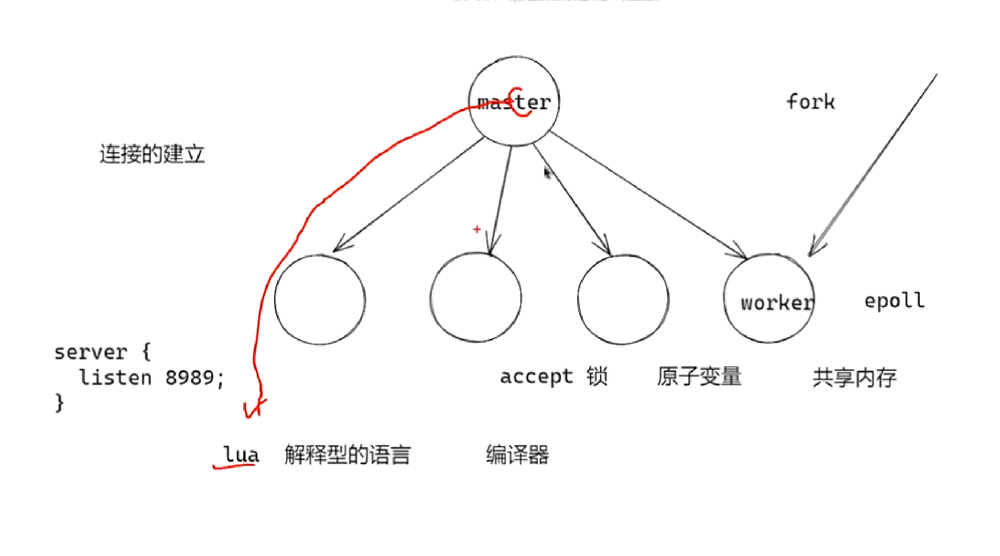
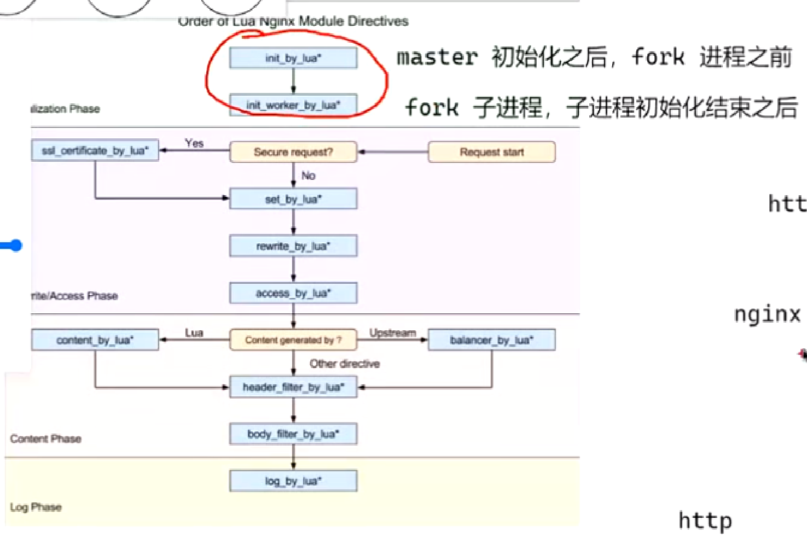
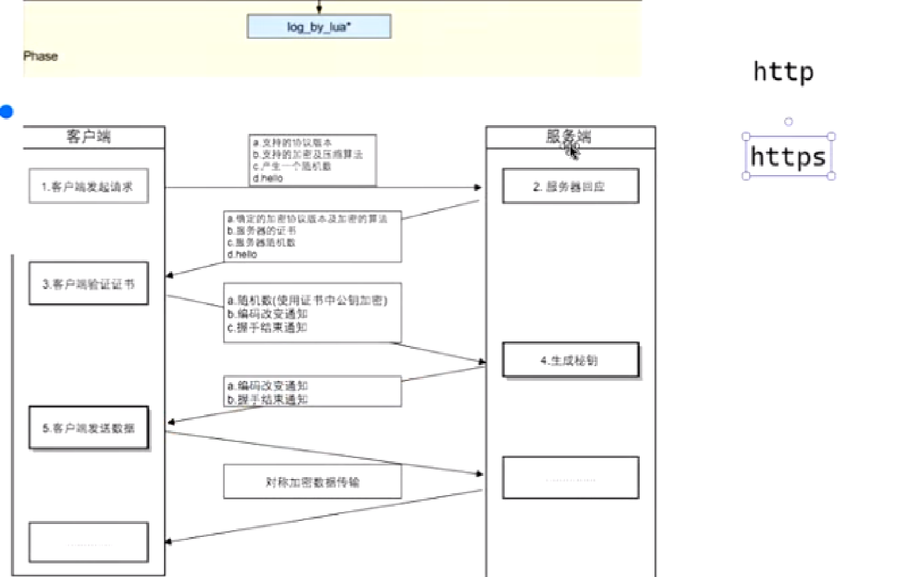
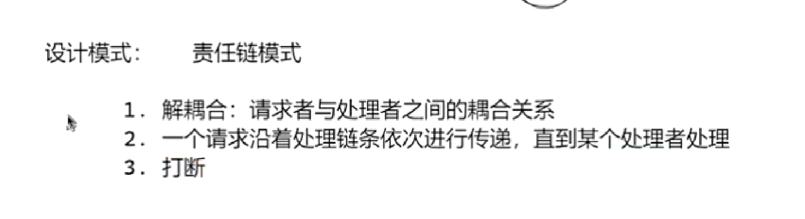
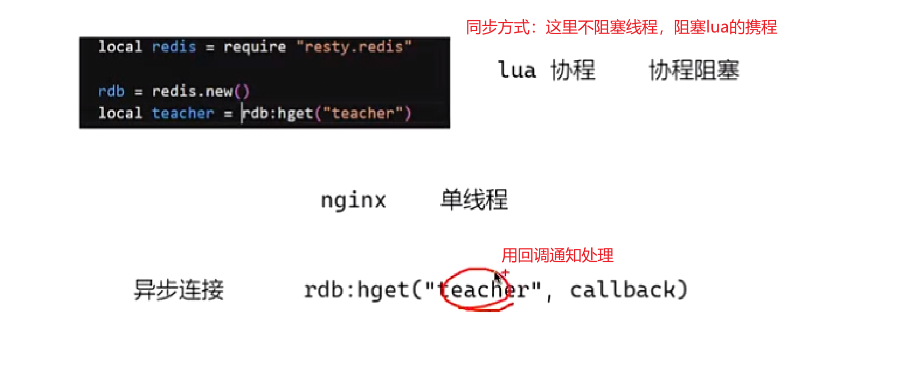
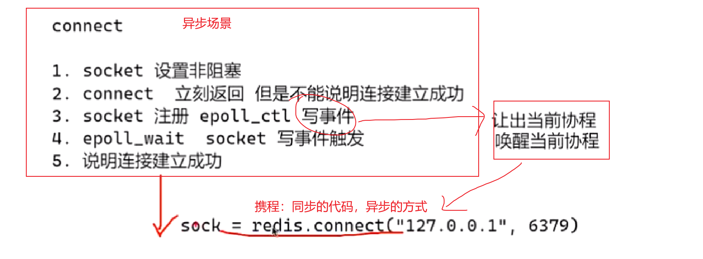
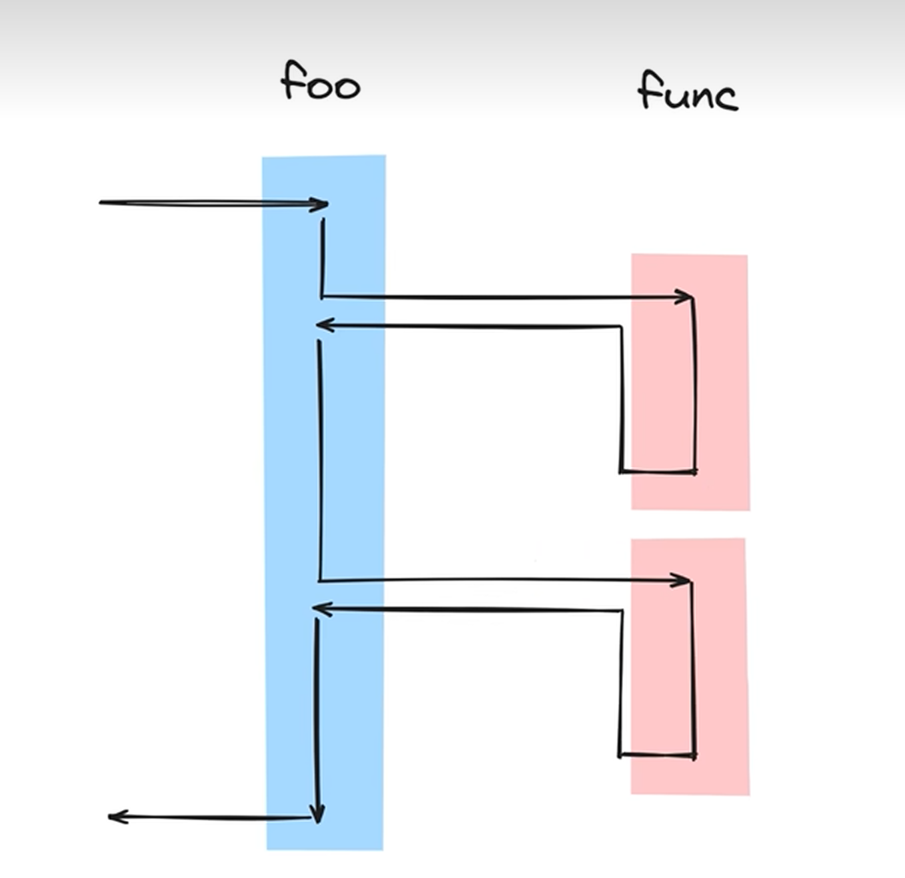
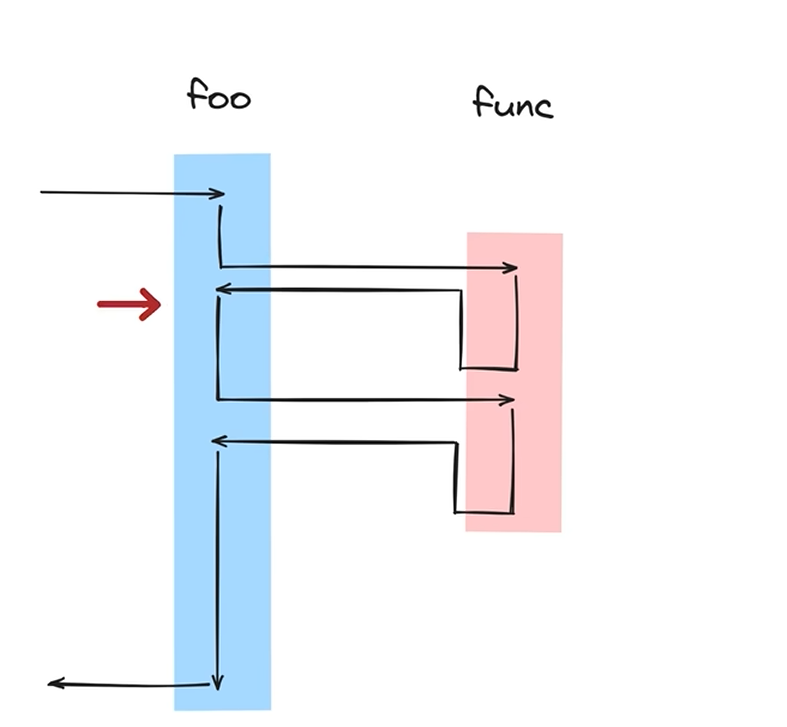

Openstry

问题：nginx是由c语言写的，我们加入了lua语言，这两种语言写的代码如何协同开发？

答：主体还是c语言，其实就是由c语言实现了lua的解释器（lua是解释型语言），lua的执行都是在这个解释器上执行的。

问题：这两种代码会同时执行吗？

答:不会，nginx是多进程，单线程的设计，在一个进程中，只有一个线程，同一时刻只会执行一种代码

https的过程：

lua的调用流程

用lua调用优势：lua是一门解释性语言，使用lua修改时不需要重新编译nginx

加入握手，并且将所有数据进行对称加密

涉及责任链设计模式：

高耦合：我只需要直接你的接口就行，不需要看懂你怎么写的才可以实现我的任务

同异步方式

携程的例子

携程阻塞在connect（同步），让出了执行权，让别人占用cpu。。。（异步）

携程与普通函数的区别

普通函数：

携程：

携程与线程的区别：

携程和线程都可以暂停和恢复，但是携程的暂停恢复用户**可见**，线程暂停恢复用户**不可见**

携程运行在用户态，线程运行在内核态

也就是说

**携程的运行和停止是程序员自己控制的，线程是操作系统控制的！！！**

openrestry实现黑白名单：

方案1：写死nginx.conf

缺点：每次修改都要reload，线上不可行

方案2：nginx.conf写调用别的conf，每次读取redis查看名单

改进：不需要重启nginx

缺点:每次连接都要查询redis，影响性能

方案3：共享内存

正确解决方案

openresty导致ip丢失问题：

1.需要启动协议proxy protocol on

2.可以写一个lua，把ip从第一个数据包发送给server